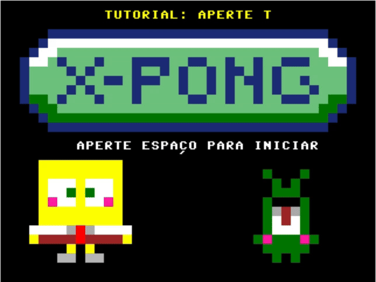

# X-Pong: A SpongeBob SquarePants Pong Clone in Assembly

## About

This code was made for the final project of our class "Organização e Arquitetura de Computadores - SSC0513", the main goal of our project is to implement the classic Pong game with the SpongeBob SquarePants theme.

## How to play it?

You gonna need 2 .mif files `pong.mif` and `charmap.mif`, then you just need to access <link>https://thiagoambiel.github.io/SimuladorICMC/</link>, upload these 2 files and click at "Executar" (we recommend to set the clock nearly to the max).

## Project Demonstration 

